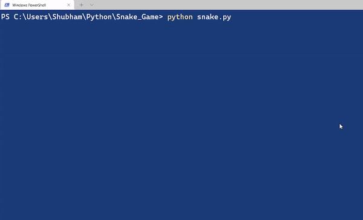

# Snake Game using Pygame
-------------------------



Steps:
------

1. Define the board size
2. Pygame code

```python
pygame.display.set_caption("")
win = pygame.display.set_mode((width,height))
clock = pygame.time.Clock()
while(1):
	clock.tick(10)
	# code
	for event in pygame.event.get():
		if(event.type == pygame.QUIT):
			pygame.quit()
```

3. Moving snake
4. Check Boundary conditions
5. Food Generation(at random)
6. Increasing snake body and Changing snake color
7. Score Updation